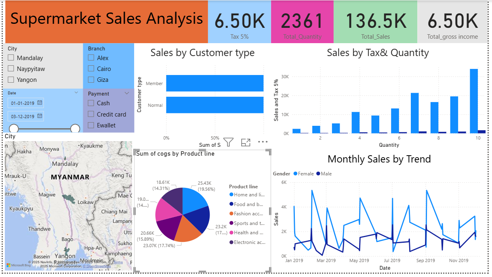

# Supermarket Sales Analysis – Excel + Power BI Project

## Project Overview

In this project, I worked on supermarket sales data. First, I cleaned the data using Excel. After that, I created a sales dashboard in Power BI to show key insights like total sales, quantity, tax, and gross income.

## My Process:

1. **Excel Data Cleaning:**

   * Removed duplicates.
   * Handled missing values.
   * Created new columns like Tax 5% and Gross Income.

2. **Power BI Dashboard:**

   * Imported the cleaned Excel file.
   * Added visuals:

     * KPI Cards (Total Sales, Quantity, Tax, Gross Income)
     * Sales by Customer Type (Bar Chart)
     * Sales by City (Map Chart)
     * Monthly Sales Trend (Line Chart)
     * Product Line Breakdown (Pie Chart)

## Dashboard Preview:

## Files Included:

* `SuperMarket Analysis.xlsx` – Cleaned Excel file.
* `Dashboard.png` – Power BI dashboard image.

## Key Insights:

* Total Sales: 136.5K
* Home and Lifestyle is the top product line.
* Female customers have a higher sales trend.
* E-wallet is the most used payment method.
* Yangon city has the highest sales.

## Tools I Used:

* Microsoft Excel 365
* Microsoft Power BI
